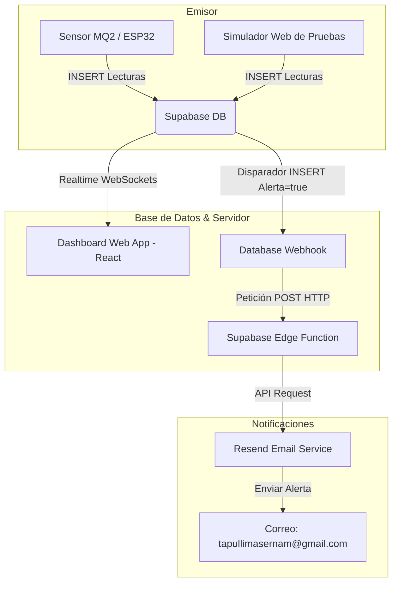

# SmartSense — Sistema IoT de Monitoreo de Gas & Humo

Este documento detalla la arquitectura, el esquema de base de datos, la configuración del entorno y el sistema de alertas implementado en el proyecto **SmartSense**.

---

## 1. Arquitectura del Sistema

El flujo de datos del sistema está diseñado para conectar de manera eficiente el sensor físico (o simulador), la base de datos en la nube, la interfaz del usuario y los servicios de notificación automáticos.



---

## 2. Base de Datos (Supabase)

La base de datos relacional utiliza tres tablas principales alojadas en Supabase. El script de base de datos se encuentra detallado en el archivo [scrip.sql](scrip.sql).

### 2.1. Tabla `configuracion`
Almacena la calibración de umbrales para el sensor. El ESP32 lee esta tabla para ajustar la sensibilidad de la alarma física y el aplicativo web la lee para marcar los estados de alerta.

* **Estructura:**
  * `id` (`bigint`, PK, default `1`): Fila única para la configuración global.
  * `umbral_gas` (`integer`, default `1500`): Límite de ppm (partes por millón) tolerables.
  * `created_at` (`timestamp with time zone`): Registro de creación.

### 2.2. Tabla `usuarios`
Almacena los datos del usuario, las credenciales WiFi que lee el microcontrolador al iniciar y las preferencias de notificación de alarmas.

* **Estructura:**
  * `id` (`bigint`, PK, default `1`): Fila única del usuario activo.
  * `nombre` (`text`): Nombre del propietario.
  * `email` (`text`): Correo destinatario de alertas de gas.
  * `telefono` (`text`): Número de celular para notificaciones SMS.
  * `wifi_ssid` (`text`): Nombre de la red WiFi IoT doméstica.
  * `wifi_password` (`text`): Clave de la red WiFi.
  * `notif_email` (`boolean`, default `true`): Interruptor para activar/desactivar correos de alerta.
  * `notif_sms` (`boolean`, default `false`): Interruptor para activar/desactivar alertas SMS.

### 2.3. Tabla `gas_eventos`
Registro histórico de las mediciones de ppm recolectadas. 

* **Estructura:**
  * `id` (`uuid`, PK, autogenerado): Identificador único de lectura.
  * `created_at` (`timestamp with time zone`, default `now()`): Fecha y hora exacta de la medición.
  * `valor_gas` (`integer`): Nivel analógico mapeado (rango `0` - `4095`).
  * `alerta` (`boolean`): Bandera que indica si el valor excedió el umbral activo (`valor_gas` > `umbral_gas`).

---

## 3. Variables de Entorno y Configuración Local

La comunicación entre el cliente web (Vite) y los servicios externos se realiza de forma segura mediante el archivo [.env.local](.env.local):

* **`VITE_SUPABASE_URL`**: Enlace del endpoint de tu proyecto Supabase.
* **`VITE_SUPABASE_ANON_KEY`**: Clave pública anónima de la API de Supabase.
* **`GEMINI_API_KEY`**: Clave de Google AI Studio (reservado para futuras expansiones con IA).
* **`APP_URL`**: Dirección web del host local (`http://localhost:3000`).

---

## 4. Conexión Autocurable (`supabase.ts`)

Para evitar errores en el arranque inicial del aplicativo cuando la base de datos está vacía, el archivo de conexión [supabase.ts](src/lib/supabase.ts) incluye una lógica de **inicialización automática**:
* Si al iniciar la aplicación web no se encuentra un registro con `id = 1` en las tablas `configuracion` y `usuarios` (error `PGRST116` de Supabase), el código realiza un `INSERT` automático con los valores por defecto. Esto garantiza que las funciones de actualización (`UPDATE`) no fallen.

---

## 5. Sistema de Alertas por Correo (Resend)

El sistema de notificaciones se ejecuta de forma asíncrona directamente en la nube utilizando **Edge Functions** y **Webhooks** de Supabase.

### 5.1. Edge Function (`notificar-alerta`)
Ubicada en [supabase/functions/notificar-alerta/index.ts](supabase/functions/notificar-alerta/index.ts), está construida sobre Deno y realiza las siguientes tareas:
1. **Recibe la lectura:** Obtiene los datos del nuevo registro insertado en `gas_eventos` a través de un JSON POST.
2. **Consulta Preferencias:** Conecta internamente a la tabla `usuarios` para obtener en tiempo real a qué dirección enviar la alerta y verifica si las notificaciones de correo (`notif_email`) están activas.
3. **Envía el Correo:** Si el correo está habilitado y el valor sobrepasa el umbral (`alerta = true`), realiza una petición HTTP segura a la API de **Resend** usando la clave secreta `RESEND_API_KEY` de tu cuenta.
4. **Plantilla HTML Premium:** Redacta un correo estructurado y visualmente profesional que incluye el valor detectado en ppm, la hora exacta formateada con la zona horaria del usuario y recomendaciones de seguridad críticas.

### 5.2. Disparador en Supabase (Database Webhook)
Configurado desde la consola de Supabase (**Integraciones > Database Webhooks**):
* **Tabla de escucha:** `gas_eventos`.
* **Evento de disparo:** `INSERT`.
* **Destino:** Supabase Edge Function `notificar-alerta`.

---

## 6. Instrucciones de Ejecución Local

1. Asegúrate de tener instalado **Node.js**.
2. Instala los paquetes del proyecto:
   ```bash
   npm install
   ```
3. Configura el archivo [.env.local](.env.local) con tu `VITE_SUPABASE_URL` y `VITE_SUPABASE_ANON_KEY`.
4. Inicia el servidor de desarrollo local:
   ```bash
   npm run dev
   ```
5. Abre [http://localhost:3000](http://localhost:3000) en tu navegador.
